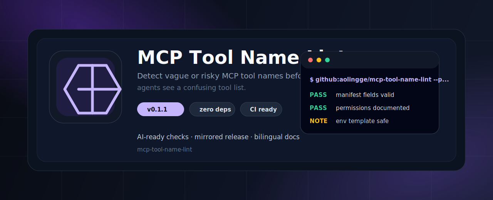
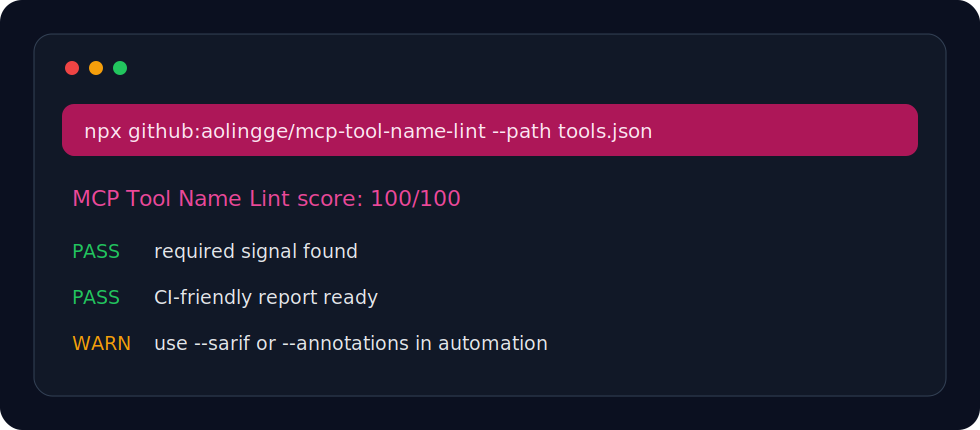

<p align="center">
  
</p>

<h1 align="center">MCP Tool Name Lint</h1>

<p align="center">在 Agent 看到工具列表前，检查 MCP tool 名称是否含糊或危险。</p>

<p align="center"><a href="README.md">English</a> · <a href="#快速开始">快速开始</a> · <a href="#检查项">检查项</a></p>

<p align="center">
  
  
  
</p>

<p align="center">
  
</p>

## 为什么做这个

AI Agent 工具链正在快速增长，但很多仓库缺少能直接放进 CI 或本地预检的小工具。这个项目保持零依赖、命令短、输出清楚，适合被收藏、fork、二次改造。

## 快速开始

```bash
npx github:aolingge/mcp-tool-name-lint --path tools.json
```

Generate Markdown:

```bash
npx github:aolingge/mcp-tool-name-lint --path tools.json --markdown > report.md
```

Use a score gate:

```bash
npx github:aolingge/mcp-tool-name-lint --path tools.json --min-score 80
```

## 检查项

| Check | What it looks for |
| --- | --- |
| has-tools | Contains tool names and descriptions. |
| specific | Uses action-oriented names. |
| description | Includes descriptions. |
| risk | Makes risky tools visible. |

## Output

```text
MCP Tool Name Lint score: 100/100
PASS  example-check  Useful signal found
FAIL  missing-check  Add the missing guidance
```

## 参与贡献

Good first PRs: add checks, add fixtures, improve docs, or add GitHub Actions examples.

## License

MIT
